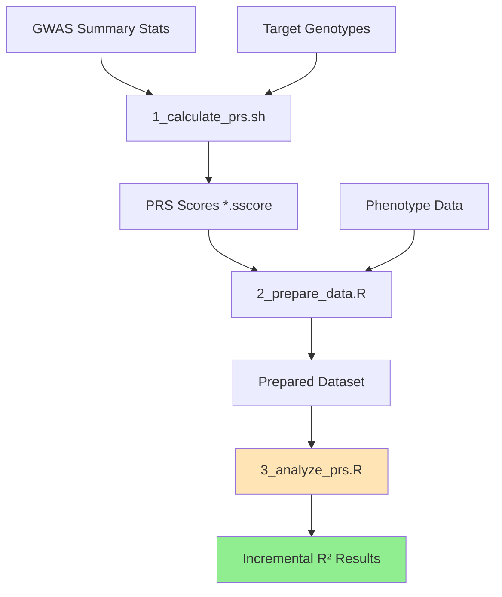

# 🧬 Polygenic Risk Score (PRS) Analysis Pipeline

**A complete pipeline for calculating and analyzing polygenic risk scores with proper incremental R² reporting.**

## ⭐ Key Feature: Incremental R² Analysis

This pipeline correctly calculates **incremental R²** = R²_(PRS + PCs) - R²_(PC only), showing the **true PRS contribution** separate from population structure effects.

**Why this matters:**
- Traditional "total R²" increases with more PCs due to population structure
- **Incremental R²** remains stable and shows actual genetic signal
- Essential for proper PRS performance reporting

---

## 🚀 Quick Start

### 1. Configure Pipeline
```bash
# Edit PLINK parameters and file paths
vim prs_config.sh

# Edit data preparation settings  
vim data_prep_config.json
```

### 2. Run Complete Pipeline
```bash
# Case-control analysis (default)
./run_prs_pipeline.sh /path/to/phenotypes.csv my_scz_analysis binomial

# Continuous trait analysis
./run_prs_pipeline.sh /path/to/phenotypes.csv my_height_analysis continuous

# PRS calculation only (will default to binomial for analysis)
./run_prs_pipeline.sh "" prs_only
```

### 3. Interpret Results
- **PC-only R²**: Population structure baseline
- **Full R²**: Total variance (PRS + population structure)  
- **Incremental PRS R²**: 🎯 **True PRS performance** (use this for reporting!)

---

## 🎯 Trait Types Supported

| Trait Type | Description | Analysis Method | Example |
|------------|-------------|-----------------|---------|
| **Binomial** | Case-control (0/1) | Logistic regression | Schizophrenia, Depression |
| **Continuous** | Quantitative traits | Linear regression | Height, BMI, IQ |

**Default:** Binomial (most common for psychiatric genetics)

## 📋 Pipeline Components

| Script | Purpose | Key Output |
|--------|---------|------------|
| `1_calculate_prs.sh` | Calculate PRS from GWAS | `*.sscore` files |
| `2_prepare_data.R` | Merge PRS + phenotype data | Standardized CSV |
| `3_analyze_prs.R` | **Incremental R² analysis** | Results with true PRS R² |
| `run_prs_pipeline.sh` | **Complete workflow** | Full analysis |

---

## 📊 Quality Control Steps

### Base Data (GWAS) QC:
- Remove missing data - ensures complete SNP information
- Filter ambiguous SNPs (A/T, G/C) - prevents strand alignment issues  
- MAF filtering (>0.01) - removes rare variants with unstable estimates
- INFO score filtering (>0.8) - quality control for imputed variants
- Duplicate removal - prevents double-counting of variants
- Effect size transformation - converts OR to log(OR) when needed

### Target Data QC:
- Genotype missingness (<5%) - removes poor quality SNPs
- Sample missingness (<5%) - removes poor quality individuals
- MAF filtering (>0.01) - ensures sufficient allele counts
- HWE test (p>1×10⁻⁶) - detects genotyping errors
- Sex check - identifies sample mix-ups
- Relatedness check - removes related individuals

### LD Clumping:
- Removes correlated variants (r² > 0.1 within 250kb)
- Keeps most significant SNP per LD block  
- Critical to avoid double-counting genetic signals

### P-value Thresholds:
- Tests multiple thresholds (5×10⁻⁸ to 1.0)
- Finds "best-fit" using **incremental R²** (not inflated total R²)
- Balances signal vs. noise

---

## ⚡ Expected Runtime

| Data Size | Runtime |
|-----------|---------|
| Small (1K samples, 100K SNPs) | 15-30 min |
| Medium (10K samples, 1M SNPs) | 1-2 hours |
| Large (100K samples, 10M SNPs) | 4-8 hours |

---

## 🔧 Configuration Files

### `prs_config.sh`
```bash
# Target genotype data
TARGET_GENO="/path/to/genotypes"  # Without extension
TARGET_FORMAT="bed"  # or "pgen"

# GWAS summary statistics  
GWAS_SUMSTATS="/path/to/gwas.txt"
SNP_COL=2
A1_COL=4  
BETA_COL=9
PVAL_COL=11

# Output location
OUTPUT_DIR="/path/to/output"
PROJECT_NAME="my_prs"
```

### `data_prep_config.json`
```json
{
  "filter_steps": [
    {
      "name": "population_filter",
      "enabled": true,
      "settings": {
        "column_name": "Race",
        "allowed_populations": ["Caucasian"]
      }
    },
    {
      "name": "case_control_definition", 
      "enabled": true,
      "settings": {
        "control_criteria": {"SCZ_general": 0},
        "case_criteria": {"SCZ_general": 1}
      }
    }
  ]
}
```

---

## 📈 Understanding Results

### Incremental R² Example:
```
PC Count: 3    | PC-only R²: 10.4% | Full R²: 26.1% | Incremental PRS R²: 15.7%
PC Count: 10   | PC-only R²: 18.9% | Full R²: 31.6% | Incremental PRS R²: 12.8%
PC Count: 20   | PC-only R²: 25.2% | Full R²: 38.1% | Incremental PRS R²: 12.9%
```

**Key insight:** 
- Total R² increases linearly (26.1% → 38.1%) due to population structure
- **Incremental PRS R² stays stable (~13-16%)** - this is the true genetic signal!

### 🎯 **Always report incremental R² for PRS performance**

---

## 🛠️ Troubleshooting

### Common Issues:

**"Column out of bounds"**
→ Check SNP_COL, A1_COL, etc. in `prs_config.sh`
→ Open GWAS file and count columns (starting from 1)

**"No variants found"**  
→ Check SNP ID format matches (rs IDs vs chr:pos)
→ Check genome build matches (hg19 vs hg38)

**"Permission denied"**
→ Run: `chmod +x *.sh`

**"plink2: command not found"**
→ On Sherlock: `ml biology && ml plink/2.0a7`

**"R² seems too high"**
→ Check you're using **incremental R²**, not total R²
→ High total R² often reflects population stratification

**"Wrong trait type specified"**
→ Script will warn you if binomial/continuous doesn't match your data
→ Binomial: expects 0/1 values (cases/controls)
→ Continuous: expects numeric values with >2 unique values

---

## 📚 Key References

- **Incremental R² methodology**: This pipeline implements best practices for separating PRS signal from population structure
- Choi et al. (2020) "A guide to performing PRS analyses" 
- Lambert et al. (2022) "UK Biobank PRS practical guide"
- PRS Tutorial: [choishingwan.github.io/PRS-Tutorial/](https://choishingwan.github.io/PRS-Tutorial/)

---

## 🏆 Best Practices

1. **Always use incremental R²** for reporting PRS performance
2. **Use 3-10 PCs** for population structure control (incremental R² should be stable)
3. **Validate in independent samples** when possible
4. **Report both OR and R²** for clinical interpretation
5. **Check for population stratification** before interpreting results

---

## 📋 Output Files

### PRS Calculation:
- `{project}.prs.*.sscore` - PRS scores for each p-value threshold
- `{project}_QC_REPORT.txt` - Quality control summary

### Analysis Results:
- `{analysis}_results.csv` - Detailed results with incremental R²
- `{analysis}_summary.txt` - Human-readable summary  
- `{analysis}_prs_comparison.csv` - Best PRS comparison table

---

## 🔄 Pipeline Workflow



---

*Pipeline developed with proper incremental R² implementation to address common PRS analysis pitfalls.*